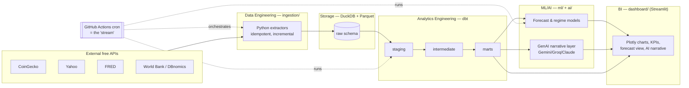

# Markets & Macro Intelligence — Project Plan

> A zero-cost, code-first data platform that ingests live markets + macro data, transforms
> it with dbt, runs ML forecasts, layers a GenAI narrative on top, and serves it all through
> a Streamlit dashboard — an end-to-end, production-shaped platform across **Data Engineering**,
> **Analytics Engineering**, **ML/AI**, and **BI**.

**Author:** mathsisbest · **Status:** Plan + working scaffold · **Cost target:** £0 / $0 forever

> **Implementation status (P0 hygiene pass).** The scaffold is real and CI-gated: ingestion
> (CoinGecko/Yahoo/FRED/World Bank), a complete dbt project (staging→intermediate→marts + tests),
> an ML forecast + regime layer, a provider-agnostic GenAI brief, and the Streamlit dashboard all
> run on seeded data in CI. **Roadmap (described below but not yet built):** the DBnomics
> sources, per-source incremental watermarks + `make backfill`, full Pydantic payload models, dbt
> source-freshness surfaced in the UI, and macro ML features. **Storage:** local DuckDB for dev/CI;
> **MotherDuck** free tier for the deployed/scheduled path (the `.duckdb` binary is not committed).

---

## 1. Why this project

One realistic system where data flows end-to-end and every layer is done *properly*, rather than
four disconnected notebooks. The whole platform tells a single story:

> *"Raw market and macro data is streamed in on a schedule, modelled into clean analytical
> tables, scored by ML models, explained in plain English by an LLM, and presented in a live
> dashboard — all reproducible, tested, CI-checked, and running at zero cost."*

Each layer maps to a part of the modern data stack:

| Layer | Where it lives | What it does |
|---|---|---|
| **Data Engineering** | `ingestion/` extractors + GitHub Actions cron + idempotent loads to DuckDB/Parquet | Reliable, scheduled, incremental pipelines |
| **Analytics Engineering** | `transform/` dbt project: staging → intermediate → marts, tests, docs, lineage | Modern-stack data modelling, with tests and contracts |
| **ML / AI** | `ml/` forecasting + regime detection with proper backtesting & tracked metrics | Models framed, trained, evaluated and shipped — not just `.fit()` |
| **GenAI** | `ai/` provider-agnostic LLM layer that writes the daily market narrative | LLMs used deliberately, with cost/abstraction awareness |
| **BI** | `dashboard/` Streamlit app: code-defined Plotly charts, KPIs, filters | Insight communicated visually, entirely in code |

---

## 2. Domain decision — chosen on *free-data availability*

The domain was chosen on which datasets are genuinely free. Here's the honest
comparison that drove the decision:

| Domain | Best free source(s) | Free limit | History | "Streaming" fit | Verdict |
|---|---|---|---|---|---|
| **Macro** | FRED, World Bank, DBnomics | Effectively unlimited, stable | Decades | Low (monthly/quarterly data) | ✅ Core — rock-solid free backbone |
| **Investing / markets** | Yahoo (no key), CoinGecko | CoinGecko 100 calls/min, 10k/mo | Years–decades | **High** (crypto updates per-minute) | ✅ Core — best streaming + ML data |
| **Sports betting / odds** | The Odds API | ~500 credits/month (~16/day) | Scarce when free | Medium but quota-limited | ⚠️ Optional Phase-2 module |

**Decision: anchor on "Markets & Macro."** Crypto gives a *real* high-frequency streaming
narrative for free; equities/FX give deep ML-ready history; macro gives analytical depth and
great BI storytelling. Sports betting is included as a **fully-specified optional module**
(see §13) so it can be switched on later — but its free quota is too thin to carry the
"streaming" story, so it isn't the core.

Markets and macro combine into one narrative:
**treating markets and the economy as a single system to measure and forecast.**

---

## 3. Data sources & how to "stream" them for free

### 3.1 Sources

| Source | Data | Auth | Cadence we pull | Free limits (verified Jun 2026) |
|---|---|---|---|---|
| **CoinGecko** (Demo API) | Crypto prices, market caps, volume | Free demo key | Every 15–30 min | 100 calls/min, 10k calls/month |
| **Yahoo** (v8 chart) | Daily *adjusted* close for equities/ETFs/bonds/commodities/FX + daily BTC | None | Daily | Unofficial endpoint (browser UA); the working price source |
| **Stooq** *(dormant)* | Daily OHLC — replaced by Yahoo; free CSV now returns a JS challenge | None | — | Out of `EXTRACTORS`, untested |
| **FRED** (St. Louis Fed) | US macro: CPI, rates, unemployment, yield curve, M2 | Free API key | Daily check (data is monthly) | Generous; no hard public cap |
| **World Bank** | Cross-country GDP, inflation, indicators | None | Weekly | None |
| **DBnomics** | Aggregator over ECB/Eurostat/IMF/OECD | None | Weekly | None |
| *(optional)* **The Odds API** | Sports odds & line movement | Free key | 2–3×/day | 500 credits/month |

> **Implemented today:** CoinGecko, **Yahoo** (price history incl. daily BTC), FRED, World Bank.
> **Dormant:** Stooq (free CSV endpoint now returns a JS challenge — out of `EXTRACTORS`).
> **Roadmap:** DBnomics is part of the design but not yet implemented.

### 3.2 The "streaming" strategy on £0

True always-on streaming (Kafka/Kinesis) costs money and is overkill for this data. The
professional, free-tier-appropriate pattern is **scheduled micro-batch ingestion** with
incremental, idempotent loads — which is how most real analytics platforms actually run:

- **Scheduler:** GitHub Actions `schedule:` cron. Private repos get **2,000 free Linux
  minutes/month** — the shipped default is a ~60-second job every 6h (~120 min/month), well
  inside the quota. (A 30-min crypto refresh is an aspirational upper bound, not the shipped
  cadence.)
- **Idempotency:** each extractor upserts on a natural key (`symbol + timestamp`) so re-runs
  never duplicate. *(Implemented.)* True per-source incremental watermarks are **roadmap** —
  today's loads are a full scheduled refresh (see the source-specific policy in §7.1).
- **Freshness (roadmap):** dbt `source freshness` surfaced in the dashboard is planned. The
  `pipeline_runs` audit table exists today; the dbt freshness + UI surface are not yet built.
- **Backfill path (roadmap):** a `make backfill` target to pull full history once is planned,
  not yet implemented.

> Phase 4 (§12) adds an optional literal-streaming demo using **Redpanda Serverless free tier**
> or a local `kafka-python` producer/consumer — deliberately not on the critical path because
> it isn't free at scale.

---

## 4. Architecture



**Medallion-style layering** (raw → staging → marts) is the analytics-engineering convention;
it keeps ingestion dumb and reliable while all business logic lives in version-controlled,
tested SQL.

---

## 5. Tech stack — and why each piece is free

| Concern | Choice | Why / free-tier note |
|---|---|---|
| Language | **Python 3.11+** | Ubiquitous for data/ML; one language across all layers |
| Ingestion | **httpx + pandas + pydantic** | Typed, testable extractors |
| Storage | **DuckDB** (local dev/CI) + **MotherDuck** free tier (deployed) | Zero-infra OLAP engine; the scheduled cron + dashboard share state via MotherDuck. The `.duckdb` binary is **not** committed to git |
| Transform | **dbt-core + dbt-duckdb** | Industry-standard analytics engineering; 100% open-source |
| ML | **scikit-learn, statsmodels** | Classic, explainable, no GPU needed |
| Experiment tracking | **JSON metrics + DuckDB `model_metrics` table** | Free, no MLflow server needed (MLflow optional later) |
| GenAI | **Provider-agnostic client** → default **Google Gemini free** (1,500 req/day) or **Groq free**; **Claude** as a drop-in | Truly free default; Claude optional (see honesty note §10) |
| Dashboard | **Streamlit** | Code-defined UI + charts; **free Community Cloud** hosting that deploys from **private** repos |
| Charts | **Plotly** | Fully code-driven, interactive, themeable |
| Orchestration | **GitHub Actions** | 2,000 free private-repo minutes/month |
| Quality | **ruff, pytest, pre-commit, mypy** | All free, all standard |
| CI | **GitHub Actions** (lint + test on PR) | Same free quota |
| Config/secrets | **pydantic-settings + .env + GH Actions secrets / Streamlit secrets** | No secret-manager cost |

---

## 6. Repository structure

```
markets-macro-intelligence/
├── README.md                      # Entry point: what/why/how-to-run, badges, screenshots
├── PLAN.md                        # This document
├── LICENSE                        # MIT
├── pyproject.toml                 # Deps + tool config (ruff, pytest, mypy)
├── Makefile                       # make ingest / build / test / dashboard / all
├── .env.example                   # Documents every required secret (no real values)
├── .pre-commit-config.yaml        # ruff + format on commit
├── .gitignore
│
├── .github/workflows/
│   ├── ci.yml                     # lint + type-check + tests on every PR
│   ├── ingest.yml                 # CRON: the "stream" — scheduled ingestion + dbt + ML
│   └── deploy-note.md             # how Streamlit Cloud auto-deploys on push
│
├── config/
│   ├── settings.py                # pydantic-settings: typed config from env
│   └── assets.yml                 # which tickers/series to track (declarative)
│
├── src/mmi/                       # installable package (good SWE: no loose scripts)
│   ├── ingestion/                 # ── DATA ENGINEERING ──
│   │   ├── base.py                # Extractor ABC: fetch→validate→load, idempotent
│   │   ├── coingecko.py
│   │   ├── stooq.py
│   │   ├── fred.py
│   │   ├── worldbank.py
│   │   └── loader.py              # DuckDB upsert + watermark + audit log
│   ├── ml/                        # ── ML / AI ──
│   │   ├── features.py
│   │   ├── forecast.py            # train/eval/backtest, saves metrics
│   │   └── regime.py              # volatility-regime detection
│   ├── ai/                        # ── GENAI ──
│   │   ├── llm.py                 # provider-agnostic client (Gemini/Groq/Claude)
│   │   └── narrative.py           # turns marts → daily plain-English brief
│   └── utils/                     # logging, io, dates
│
├── transform/                     # ── ANALYTICS ENGINEERING (dbt) ──
│   ├── dbt_project.yml
│   ├── profiles.yml               # points dbt at the DuckDB file
│   ├── models/
│   │   ├── staging/               # 1:1 cleaned views over raw
│   │   ├── intermediate/          # joins, returns, rolling windows
│   │   └── marts/                 # final BI tables (fct_/dim_)
│   ├── tests/                     # custom data tests
│   └── seeds/                     # static lookups (asset metadata)
│
├── dashboard/                     # ── BI ──
│   ├── app.py                     # Streamlit entry
│   ├── theme.py                   # code-defined styling
│   ├── components/                # KPI tiles, chart builders, AI panel
│   └── data.py                    # cached DuckDB reads of marts
│
├── data/                          # DuckDB file + Parquet (gitignored except samples)
│   └── samples/                   # tiny committed sample so the repo runs out-of-the-box
│
├── tests/                         # pytest: unit (extractors, features) + dbt build smoke
├── docs/
│   ├── architecture.md
│   └── adr/                       # Architecture Decision Records (e.g. "why DuckDB")
└── notebooks/                     # exploratory only, not in the critical path
```

---

## 7. Layer-by-layer design

### 7.1 Data Engineering (`src/mmi/ingestion/`)
- An `Extractor` abstract base class enforces the contract `fetch() → validate() → load()`.
  *(Implemented.)* Schema/column validation runs today; **full Pydantic payload models are roadmap.**
- `loader.py` does **idempotent upserts** into DuckDB `raw.*` tables keyed on natural keys and
  writes a row to `raw.pipeline_runs` (source, rows, duration, status) for observability.
  *(Implemented.)*
- A **watermark** helper exists, but **per-source incremental pulls are roadmap.** Planned policy:
  CoinGecko snapshot upsert (symbol + provider timestamp); Yahoo/FRED use last-loaded-date bounds;
  World Bank stays a full refresh (slow-changing reference data). Today: full scheduled refresh.

### 7.2 Analytics Engineering (`transform/` — dbt)
- **staging**: typed, renamed, de-duplicated views (one per source table).
- **intermediate**: returns, log-returns, rolling vol, moving averages, macro joins.
- **marts**: `fct_asset_daily`, `fct_crypto_intraday`, `dim_asset`, `fct_macro_indicator`,
  `fct_market_macro` (the joined "markets in macro context" table the dashboard centres on).
- **Tests**: `not_null`, `unique`, `accepted_range`, relationship tests, plus a custom test
  that returns are within sane bounds. **Source freshness** flags stale data.
- `dbt docs generate` gives free, browsable **lineage** — great to screenshot for the README.

### 7.3 ML / AI (`src/mmi/ml/`)
- **Forecast**: next-period return / volatility per asset using engineered features
  (lags, rolling stats, macro features). Honest **walk-forward backtest**, baseline comparison,
  metrics (MAE, directional accuracy) saved to `model_metrics`.
- **Regime detection**: label low/medium/high volatility regimes (e.g. Gaussian mixture or
  rolling-vol thresholds) to colour the dashboard.
- Principle emphasised: *evaluation and baselines over leaderboard-chasing.* Models are small
  and explainable — the point is method, not a giant net.

### 7.4 GenAI layer (`src/mmi/ai/`) — the future-proofing
- `llm.py` is a thin **provider-agnostic** wrapper: one `complete(prompt)` interface,
  swappable backend via `LLM_PROVIDER` env (`gemini` | `groq` | `claude`). This is the
  forward-looking design — when models change, it's one config value.
- `narrative.py` feeds the day's marts (top movers, regime, macro surprises) into a structured
  prompt and gets back a tight market brief shown in the dashboard and committed to
  `data/briefs/` so there's a history.
- Default provider = **Gemini free tier** so it costs nothing; Claude is a one-line switch.

### 7.5 BI (`dashboard/`)
- Streamlit app, **everything defined in code**: code-defined theme,
  Plotly charts, KPI tiles, sidebar filters (asset, date range, frequency), a forecast panel,
  a regime ribbon, and the **AI narrative** panel.
- `data.py` reads marts from DuckDB with `@st.cache_data` for snappy reloads.

---

## 8. Software-engineering principles baked in

- **Packaged code**, not loose scripts (`pip install -e .`); clear module boundaries per layer.
- **Typed config** via `pydantic-settings`; **secrets only via env** (`.env` gitignored,
  `.env.example` documents them); never committed.
- **Tests**: unit tests for extractors/features (with mocked HTTP), a dbt build smoke test,
  import test for the dashboard. Coverage reported in CI.
- **CI** (`ci.yml`): ruff lint+format check, mypy, pytest on every PR.
- **Lint/format**: ruff; **pre-commit** stops bad commits locally.
- **Conventional commits** + a branch-per-feature workflow; PR template.
- **Docs**: README with run instructions + screenshots, `docs/architecture.md`, and **ADRs**
  recording key decisions (why DuckDB, why micro-batch over Kafka, why provider-agnostic LLM).
- **Reproducibility**: pinned deps, `make all` runs the whole pipeline from clean, and a tiny
  committed sample dataset means a reviewer can `git clone && make dashboard` in 2 minutes.
- **Observability**: `pipeline_runs` audit table + dbt freshness surfaced in the UI.

---

## 9. Deployment (all free)

1. **Code & CI:** private GitHub repo. The gate is local `make ci` — GitHub Actions CI is `workflow_dispatch`-only to preserve the free tier, and the ingest workflow runs on demand (its 6-hourly `schedule:` is commented out until `MOTHERDUCK_TOKEN` is configured).
2. **Data:** the scheduled cron writes to **MotherDuck** (free tier) and the dashboard reads from
   it — the `.duckdb` binary is **not** committed to git. Local dev/CI use a local DuckDB file.
3. **Dashboard:** **Streamlit Community Cloud**, connected to the private repo. It sets a
   webhook, so **every push auto-redeploys**. Secrets (API keys) go in Streamlit's encrypted
   secrets box, not the repo.
4. **LLM:** Gemini/Groq free API key stored as a GH Actions secret + Streamlit secret.

---

## 10. Cost breakdown — and one honesty note

| Item | Service | Cost |
|---|---|---|
| Source data | CoinGecko / Yahoo / FRED / World Bank | £0 |
| Compute / scheduling | GitHub Actions (2,000 min/mo private) | £0 |
| Storage | DuckDB (local) + MotherDuck free tier (deployed) | £0 |
| Transform | dbt-core (OSS) | £0 |
| Dashboard hosting | Streamlit Community Cloud | £0 |
| GenAI | Google Gemini / Groq free tier | £0 |
| **Total** | | **£0 / month** |

> **Honesty note on "use Claude":** the *Claude API* is metered and **not free** — a Claude
> subscription covers chat, not API calls. So the GenAI layer is built provider-agnostic and
> **defaults to a free model (Gemini/Groq)** to keep the project at £0. Switching to Claude is a
> single env change (`LLM_PROVIDER=claude`). Also note Streamlit
> free tier allows **one app from a private repo** and ~1 GB RAM — fine for this, worth knowing.

---

## 11. Phased roadmap

| Phase | Goal | Deliverable |
|---|---|---|
| **0 — Scaffold** *(this session)* | Repo skeleton, configs, CI, one working extractor, dbt skeleton, dashboard shell, sample data | `make dashboard` runs locally |
| **1 — Data Engineering** | All extractors + cron + idempotent loads + audit table | Green ingest workflow on schedule |
| **2 — Analytics Engineering** | Full dbt staging→marts + tests + freshness + docs | `dbt build` green, lineage screenshot |
| **3 — ML/AI** | Forecast + regime models, backtest, tracked metrics | Metrics table + forecast in dashboard |
| **4 — GenAI** | Provider-agnostic narrative layer | Daily brief auto-generated & shown |
| **5 — Polish** | README screenshots, ADRs, coverage badge, deploy to Streamlit Cloud | Public-quality private repo + live URL |
| **6 — Optional** | Sports-odds module / real Kafka demo | See §13 |
| **7 — Portfolio backtesting (capstone)** | Look-ahead-free allocation backtest (equal-wt / inverse-vol / true risk-parity; ML max-Sharpe frontier as a *measured* experiment), tested portfolio marts, bootstrap CIs, regime-conditional analysis, AI commentary | See **issue #7** + its critical review; built in sub-phases 0–D, **after** P1–P3 |

> **Capstone (issue #7) — phased + dependency-noted.** The portfolio layer is the
> capstone but sits on top of P1–P3, so it's sequenced after them and built in slices: **0** data
> foundation (Yahoo *adjusted-close* ingestion — done), **A** honest core backtest, **B**
> statistical rigor + attribution, **C** ML frontier as a pre-registered experiment, **D** BTC window
> + GenAI numeric-grounding. The full critical review (incl. verified free-tier data limits) is on issue #7.

---

## 12. Risks & mitigations

| Risk | Mitigation |
|---|---|
| Free API changes limits / breaks | Provider abstraction + sample data fallback + freshness alerts |
| Yahoo's unofficial endpoint flakes | Treat as best-effort; FRED/World Bank are the reliable core |
| GitHub Actions quota creep | Keep jobs <60s, sensible cron frequency, monitor minutes |
| Committing data bloats repo | Keep only Parquet + DuckDB of tracked assets; gitignore scratch; MotherDuck option |
| LLM free-tier rate limits | Cache narratives, run once/day, exponential backoff |

---

## 13. Optional Phase-2: sports-betting module

To add it, build `src/mmi/ingestion/odds.py` against **The Odds API** free tier
(500 credits/mo → pull 2–3 sports, 2×/day). New marts `fct_odds`, `fct_line_movement`; an ML
module computing **closing-line value** and **model-vs-market edge**; a dashboard tab. It reuses
every pattern above, so it's additive, not a rewrite — but it stays optional because the free
quota can't sustain frequent "streaming."

---

## 14. What to do next

1. Review this plan; tweak the asset list in `config/assets.yml`.
2. Get free API keys: **FRED** (api.stlouisfed.org), **CoinGecko Demo**, **Gemini** (ai.google.dev).
3. Create the private GitHub repo and push the scaffold (commands provided on delivery).
4. Work the roadmap phase by phase — each phase is a clean, self-contained set of PRs.
